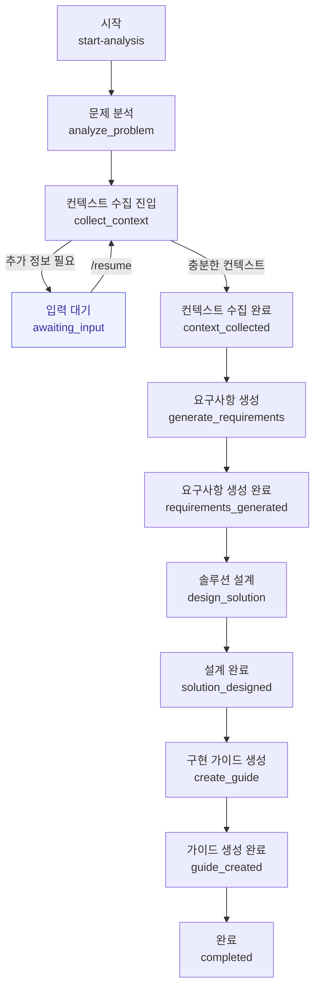

# AI 문제 해결 코파일럿 (AI Problem Solving Copilot)

AI가 문제를 구조화하고, 추가 컨텍스트를 질문으로 수집(HITL), 요구사항 문서(SRS)·사용자 여정·구현 가이드·기술 추천서를 순차적으로 생성해 주는 웹 애플리케이션입니다. 프런트는 바닐라 JS, 백엔드는 FastAPI + LangGraph 기반으로 동작합니다.

## 주요 기능
- 문제 분석: 자유 서술식 문제를 구조화(제목/도메인/카테고리/복잡도 등)
- 컨텍스트 수집(HITL): 한국어로 다양하고 구체적인 질문을 생성하여 사용자에게 추가 정보를 요청
- 문서 생성: 요구사항 명세서, 사용자 여정 지도, 구현 가이드, 기술 추천서 생성 (마크다운)
- 진행 현황 UI: 단계별(1~5단계) 진행, 일시정지(입력 대기)/오류 상태 표시, 결과 미리보기 버튼 제공
- 결과 관리: 문서 미리보기/복사/인쇄/다운로드 및 전체 일괄 다운로드

## 빠른 시작(로컬 실행)
### 1) 필수 요건
- Python 3.10 이상 권장 (3.8+ 호환)
- 인터넷(LLM 또는 Ollama 사용 시)

### 2) 백엔드 설치 및 실행
```bash
# 1) 가상환경 생성 및 활성화 (선택)
python -m venv .venv
# Windows
.\.venv\Scripts\activate
# macOS/Linux
source .venv/bin/activate

# 2) 의존성 설치
pip install -r backend/requirements.txt

# 3) 환경 변수 설정(선택)
# backend/.env.example를 backend/.env로 복사 후 값 조정
cp backend/.env.example backend/.env

# 4) 서버 실행 (FastAPI + 정적 프런트 제공)
python backend/start_server.py
```
- 기본 주소: `http://localhost:8080`
- API 문서: `http://localhost:8080/api/docs`

포트 충돌 시, start_server가 자동으로 다른 포트를 제안하거나(PSUtil 미설치 시) 안내합니다.

### 3) 프런트 접속
브라우저에서 `http://localhost:8080` 접속 → 문제를 입력하면 분석이 시작됩니다.

## 환경 변수(요약)
backend/.env에서 아래 값을 조정할 수 있습니다.
- 서버: `SERVER_HOST`, `SERVER_PORT`, `RELOAD_MODE`, `LOG_LEVEL`
- LLM: `LLM_SERVICE_TYPE`(internal|external|ollama), `OLLAMA_BASE_URL`, `OLLAMA_MODEL`, `EXTERNAL_LLM_API_URL`, `EXTERNAL_LLM_API_KEY`
- RAG: `RAG_SERVICE_ENABLED`, `RAG_API_KEY`
- CORS/세션/성능 등 기타 설정은 `backend/app/config/settings.py` 참고

## 사용 방법(요약)
1. 문제 입력: 자연어로 문제를 입력하고 시작
2. 진행 화면: 단계별 진행률/상태 확인, “결과 미리보기”로 중간 결과 확인 가능
3. 컨텍스트 수집(HITL): 화면의 한국어 질문에 답변 → 다음 질문 또는 자동 진행
4. 결과 확인: 요구사항/여정/가이드/기술추천 탭에서 문서 확인·복사·인쇄·다운로드
5. 완료: 모든 문서가 생성되면 상단에 “분석 완료” 표시

자세한 사용자 가이드는 Guide.md를 참고하세요.

## API 개요
- POST `/api/v1/start-analysis`
  - 입력: `{ problem_description: string, user_context?: object }`
  - 출력: `StatusResponse`(thread_id 포함, 비동기 진행 시작)
- GET `/api/v1/status/{thread_id}`
  - 현재 상태/진행률/대기 질문/부분 결과 반환
- POST `/api/v1/resume/{thread_id}`
  - 입력: `{ user_input: string, context_data?: object }` (질문에 대한 답)
  - 출력: 최신 상태

응답 모델은 `backend/app/models/responses.py` 참고

## 아키텍처
- 프런트: `frontend/` 바닐라 JS 컴포넌트 (진행 표시, 컨텍스트 수집, 문서 뷰어)
- 백엔드: `backend/app/` FastAPI, LangGraph 워크플로, LLM/RAG 연동
- 체크포인터(DB): SQLite 기반 상태/결과 저장

## 워크플로 그래프(Workflow Graph)
아래는 LangGraph 기반 분석 파이프라인의 핵심 노드와 전이(Transition)입니다.



상태/스텝 매핑(일부 예시)
- 분석 중: `analyze_problem` → UI “문제 분석 중”
- 컨텍스트 수집: `collect_context`/`collecting_context` → UI “컨텍스트 수집 중” (필요 시 입력 대기)
- 요구사항 생성: `generate_requirements`/`requirements_generated`
- 솔루션 설계: `design_solution`/`solution_designed`
- 가이드 생성: `create_guide`/`guide_created`
- 완료: `completed`

## 폴더 구조(요약)
```
backend/
  app/
    api/            # FastAPI 라우터(analysis)
    agents/         # analyzer/context/generator/designer/guide 에이전트
    appendix/       # LLM/RAG 통합, 템플릿 등
    config/         # 설정 로딩
    workflows/      # LangGraph 워크플로/상태
  requirements.txt
  start_server.py
frontend/
  index.html
  js/               # components, app.js, utils
  css/              # styles.css
```

## 트러블슈팅
- 포트 사용 중: start_server가 충돌 프로세스 안내/종료/포트 변경을 도와줍니다.
- 질문이 영어/이상한 경우: 잠시 후 새로고침 또는 “결과 미리보기”로 중간 결과 확인. 지속 시 `backend/debug_workflow.txt` 참고.
- 기술추천이 비어 있음: 폴백 구성이 자동 적용되도록 수정되어 있습니다. 여전히 비면 새 분석으로 재시도하세요.
- 한글 공백이 깨짐: 최신 코드에는 공백 복원 로직을 포함합니다. 여전히 문제면 이슈로 남겨주세요.

## 개발 가이드
- 코딩 스타일/작업 규칙은 루트 `AGENTS.md` 참고
- 테스트: `pytest -q` (일부 통합 테스트는 LLM/API 의존)
- 이슈/PR 환영합니다 (재현 절차·로그 포함)

## 운영자가 자주 보는 파일과 역할
| 경로 | 역할(요약) |
| --- | --- |
| `backend/start_server.py` | 서버 실행/포트 충돌 처리/안내 |
| `backend/app/config/settings.py` | 환경설정 로딩(.env), 포트·LLM·RAG 설정 |
| `backend/app/api/analysis.py` | 분석 시작/상태/재개 API (프런트와 통신) |
| `backend/app/database/checkpointer.py` | 진행 상태 저장/복원(SQLite), 세션 관리 |
| `backend/app/appendix/internal_llm.py` | LLM 연동(클라우드/로컬), 재시도·폴백 |
| `frontend/index.html` | 프런트 진입점(제목/리소스 포함) |
| `frontend/js/app.js` | 화면 전환/폴링/미리보기 제어 |
| `frontend/js/components/ProgressTracker.js` | 진행률/단계 표시, 미리보기 버튼 |
| `frontend/js/components/ContextCollector.js` | 질문 표시/답변 수집 |
| `frontend/js/components/DocumentViewer.js` | 문서 탭/복사/인쇄/다운로드 |
| `backend/debug_workflow.txt` | 워크플로 상세 로그(문제 추적 시 확인) |

---
본 프로젝트는 내부/개인 학습 및 프로토타이핑 용도로 설계되었습니다. 민감 데이터는 입력하지 마세요.
