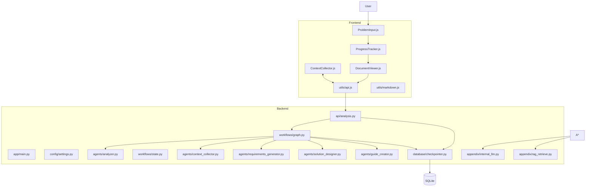
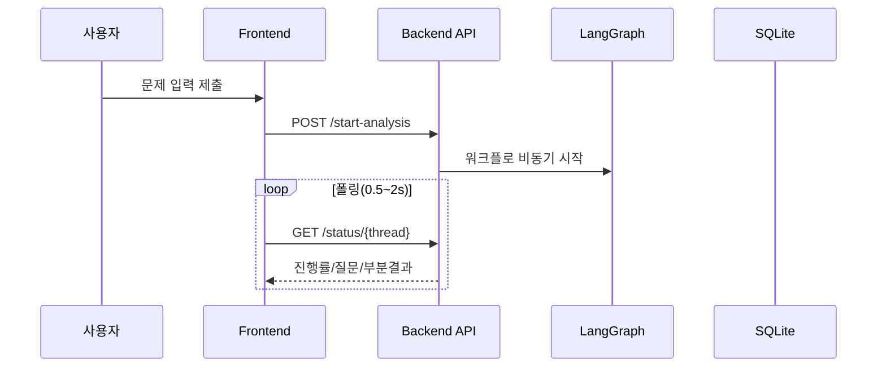
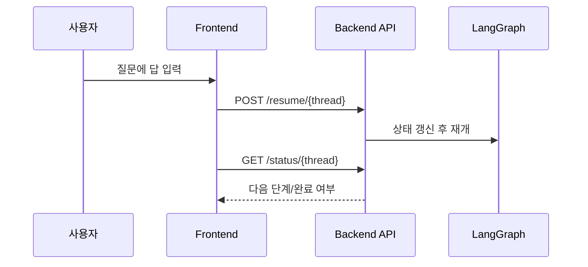

# 소프트웨어 아키텍처 기술서 (Software Architecture Document, SAD)

본 문서는 “AI 문제 해결 코파일럿” 시스템의 전체 아키텍처를 이해·운영·개발·유지보수하는 데 필요한 정보를 제공합니다. 비개발자·운영자도 쉽게 이해할 수 있도록 한국어로 서술하고, 필요한 곳에 예시와 다이어그램(mermaid)을 포함합니다.

- 문서 버전: 1.0.0
- 시스템 버전: 1.0.0
- 마지막 갱신일: 2025-09-25

---

## 1. 목적 및 범위
- 목적: 문제 분석 → 컨텍스트 수집(HITL) → 요구사항(SRS) → 솔루션 설계 → 구현 가이드 → 기술 추천서를 생성하는 전체 흐름을 기술합니다.
- 범위: 프런트엔드(바닐라 JS), 백엔드(FastAPI + LangGraph), LLM/RAG 연동, 체크포인터(SQLite), 배포/운영/보안/테스트 전략.
- 대상 독자: 제품 책임자, 운영자/PM, 개발자, SRE/Infra, 보안 담당자.

## 2. 시스템 개요
- 목표: 비개발자도 요구와 배경을 입력하면, AI가 질문으로 맥락을 보강하고 표준 문서를 자동 생성.
- 성공 지표(예):
  - 최초 산출물(요구사항 초안)까지 5분 내 도달
  - 질문(컨텍스트 수집) 3회 이내로 필수 정보 확보율 80% 이상
  - 문서 품질(내부 체크리스트) 준수율 90% 이상

## 3. 이해관계자 및 사용자
- 최종 사용자: 문제 소유자(업무 담당), PM/기획, 개발자.
- 운영자/SRE: 서버 가용성·로그·장애 대응.
- 보안: API 키/접속 통제, 개인정보·내부정보 취급 정책.

## 4. 용어
- HITL: Human-in-the-Loop(질문/답변을 통해 사람이 개입)
- RAG: Retrieval-Augmented Generation(검색 증강 생성)
- SRS: Software Requirements Specification(요구사항 명세서)

## 5. 컨텍스트(상위 수준) 다이어그램
```mermaid
flowchart LR
    U[사용자 브라우저] -- HTTP/HTTPS --> FE[Frontend (Vanilla JS)]
    FE -- REST /api/v1/* --> BE[Backend (FastAPI)]
    BE -- LLM API --> LLM[(LLM Provider \n Internal/External/Ollama)]
    BE -- RAG API --> RAG[(RAG Portal/Service)]
    BE -- SQLite --> DB[(workflow_checkpoints.db)]
```

## 6. 품질 속성(비기능 요구사항)
- 성능: 첫 응답(분석 시작) < 1s, 상태 폴링 주기 0.5~2s(적응), 문서 생성 단계별 수 초~수십 초 가능
- 가용성: 단일 노드(개발/사내) 기준, 프로세스 재시작 시 상태 복원(체크포인터)
- 확장성: LLM/RAG를 교체 가능(구성으로 전환), Stateless 프런트/Stateful 백엔드
- 보안: API 키 비밀 관리(.env), CORS 제어, 민감정보 입력 자제 권고
- 운영성: 상세 로그 `backend/debug_workflow.txt`, 오류 시 폴백/친화적 메시지 제공
- 현지화: 전면 한국어 UI/질문, 문서 생성 한국어 우선

## 7. 아키텍처 개요(스타일)
- 클라이언트-서버 3층 구조(브라우저 · FastAPI · 외부 LLM/RAG)
- 워크플로 엔진: LangGraph(StateGraph) 
- 상태 영속: SQLite(checkpointer + sessions)

## 8. 구성요소(논리/컴포넌트) 다이어그램


## 9. 런타임(시퀀스) - 분석 시작


## 10. 런타임(시퀀스) - 사용자 입력 재개


## 11. 배포 뷰(개발/사내)
```mermaid
graph LR
  B[Browser] -->|HTTP:8080| S[FastAPI App \n (start_server.py)]
  S -->|sqlite3| D[(workflow_checkpoints.db)]
  S --> L[LLM Provider]
  S --> R[RAG Service]
```
- 단일 프로세스(uvicorn) 기준. 필요 시 프록시(Nginx) 앞단 추가 가능.

## 12. 데이터 뷰(간단 스키마)
- workflow_sessions (DB: SQLite)
  - thread_id(PK), status, current_step, created_at, updated_at, completed_at, user_id, workflow_type, metadata
- checkpoints (LangGraph SqliteSaver 스키마)
  - thread_id, values(state), created_at 등 (라이브러리 스키마 따름)

## 13. API 개요(핵심)
| 메서드 | 경로 | 설명 |
|---|---|---|
| POST | /api/v1/start-analysis | 새 분석 시작(스레드 생성) |
| GET | /api/v1/status/{thread_id} | 진행률/질문/부분결과 조회 |
| POST | /api/v1/resume/{thread_id} | 질문에 대한 사용자 답으로 재개 |

예시: GET /status 응답(요약)
```json
{
  "thread_id": "7c0b...",
  "status": "collecting_context",
  "current_step": "collecting_context",
  "progress_percentage": 50,
  "requires_input": true,
  "questions": ["데이터의 출처와 형식, 예상 규모는?"],
  "results": { "requirements_document": "# ..." }
}
```

## 14. 워크플로/상태
- 주요 단계: analyze_problem → collect_context(입력 대기 루프) → generate_requirements → design_solution → create_guide → completed
- 상태 저장: SQLite 체크포인터(중단/재개 가능)

## 15. 보안
- 비밀정보: .env에 API 키/엔드포인트 저장(커밋 금지)
- CORS: 설정에 따라 허용 오리진 제어
- 개인정보: 민감정보 입력 금지 안내, 로그 공유 시 마스킹 권장

## 16. 에러 처리 & 폴백
- LLM 실패 시 재시도 → 안전한 폴백(간이 문서/추천) 
- UI: 한국어 오류 메시지·가이드 표시
- 서버: `debug_workflow.txt`에 상세 기록

## 17. 로깅 & 관측성
- 파일 로그: backend/debug_workflow.txt
- 표준 로그: uvicorn 콘솔 로그, FastAPI 로깅
- 향후: Prometheus/OTel 연동 포인트(확장 계획)

## 18. 국제화(I18N)
- 질문/문서 한국어 우선 생성
- UI 전체 한국어
- 기술 추천/가이드 프롬프트 한국어화

## 19. 테스트 전략
- 단위 테스트: 에이전트 보조 로직/파서/정규화
- 통합 테스트: /start-analysis → /status 흐름, /resume 재개
- 수동 테스트: LLM/RAG 연결 환경에서 시나리오 점검

## 20. 성능/용량 계획(개략)
- 동시 워크플로: 개발 환경 1~10 스레드 권장
- 문서 크기: 수십 KB~수백 KB
- SQLite: WAL 모드로 동시성 개선

## 21. 주요 설계 결정(요약 ADR)
- ADR-001: LangGraph 채택(상태 머신/체크포인터 제공)
- ADR-002: FastAPI 선택(비동기, 생태계/생산성)
- ADR-003: SQLite 체크포인터(WAL/개발·사내 배포 적합)
- ADR-004: LLM 추상화(internal/external/ollama 스위치)
- ADR-005: 한국어 우선 프롬프트/렌더링

## 22. 위험 및 완화
- LLM 불안정/느림 → 재시도·타임아웃·폴백 사용, 진행률 UI로 체감 개선
- 질문 공백/가독성 문제 → 전처리/후처리(한국어 공백 보정) 강화
- 기술 추천 빈 결과 → 폴백 스택/자동 recommended_stack 생성

## 23. 운영 가이드(요약)
- 시작: `python backend/start_server.py` → 브라우저 `http://localhost:8080`
- 포트 충돌: 안내에 따라 종료/포트 변경
- 설정: `backend/.env` 수정 후 재시작
- 문제 해결: `backend/debug_workflow.txt` 확인, README/Guide 참고

## 24. 변경 관리/버전
- 버전: SemVer (예: 1.0.0)
- 변경 기록: PR/커밋 메시지(Conventional Commits)
- 중요한 변경은 ADR 업데이트

## 25. 향후 과제
- 배포 템플릿(Docker) 추가, CI/CD 파이프라인
- 관측성(메트릭/트레이싱) 확대
- 문서 템플릿 다국어 확장

## 26. 부록
### 26.1. 폴더 구조(요약)
```
backend/app
  api/analysis.py            # REST 엔드포인트
  agents/                    # Analyzer/Collector/Requirements/Solution/Guide
  appendix/internal_llm.py   # LLM 연동
  database/checkpointer.py   # SQLite 체크포인터
  workflows/graph.py         # LangGraph 그래프
frontend/
  js/components/*.js         # UI 컴포넌트
  js/utils/api.js            # API 클라이언트
```

### 26.2. 주요 설정(.env)
- SERVER_HOST, SERVER_PORT, LOG_LEVEL, RELOAD_MODE
- LLM_SERVICE_TYPE(ollama|external|internal), OLLAMA_BASE_URL, EXTERNAL_LLM_API_KEY
- RAG_SERVICE_ENABLED, RAG_API_KEY

---
본 문서는 시스템의 이해·운영·개선을 돕기 위해 지속적으로 보완됩니다.
